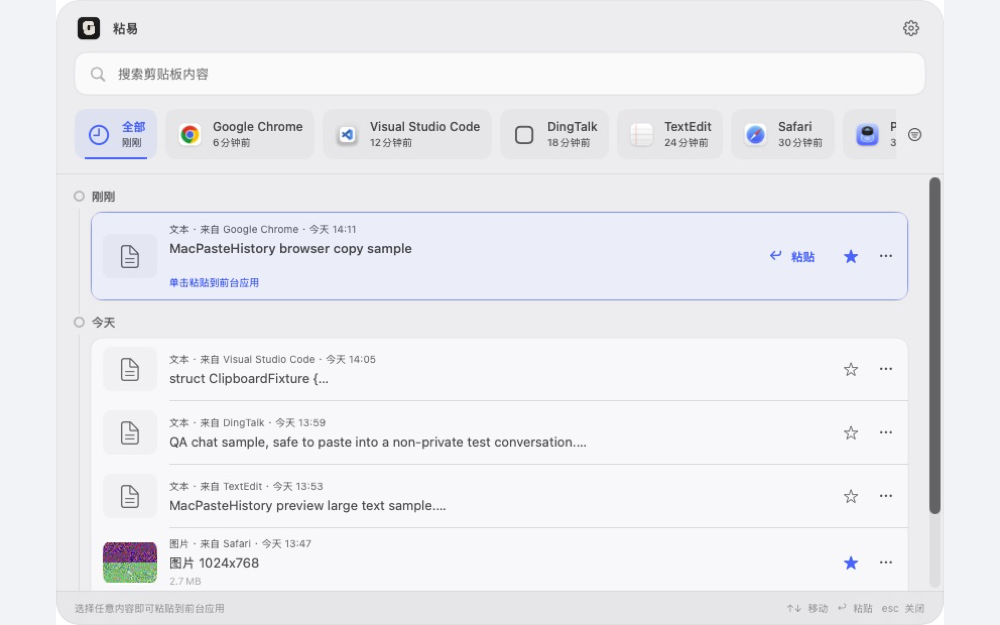
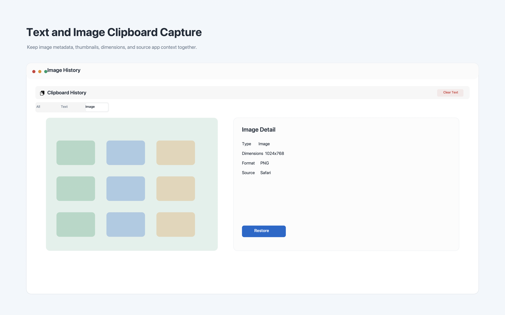
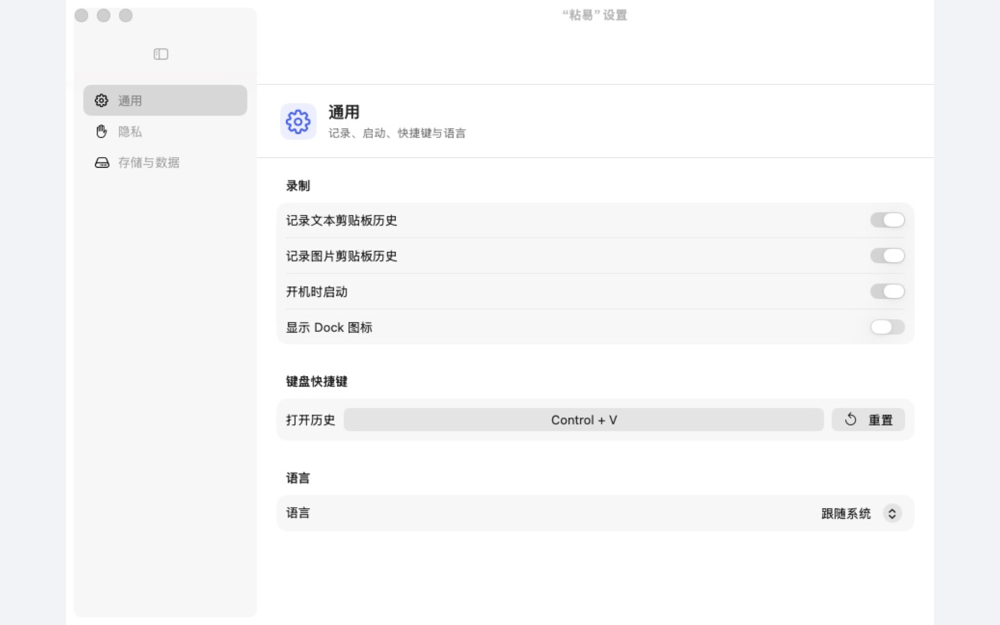
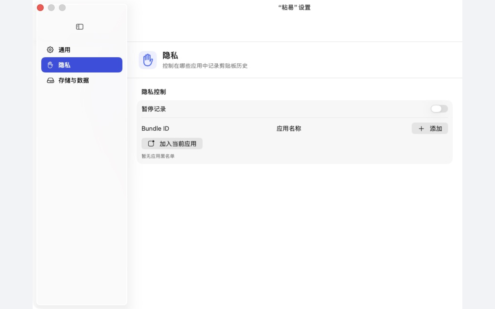

# 粘易

粘易是一款本地优先的 macOS 剪贴板历史工具。它常驻菜单栏，以顶部轻量浮层呈现文本与图片历史；选中记录后会返回原应用并自动粘贴，不打断当前工作流。

> 以下界面来自当前 Release 构建，内容均为合成示例数据，不包含真实剪贴板记录。

## 界面预览

### 时间线式复制历史



### 图片详情



### 设置与隐私控制

<table>
  <tr>
    <td width="50%"></td>
    <td width="50%"></td>
  </tr>
</table>

## 主要功能

- 记录文本与图片剪贴板历史，数据仅保存在本机
- 以来源应用快捷筛选和“刚刚 / 今天 / 更早”时间线组织历史记录
- 支持搜索、类型筛选、时间筛选与收藏
- 在全屏应用上方以轻量浮层显示，不切换到新窗口
- 点击记录后恢复剪贴板、返回原应用并自动粘贴
- 支持自定义全局快捷键，默认快捷键为 `Command + Shift + V`
- 首次启动或自动粘贴被 macOS 拦截时提供辅助功能权限提醒
- 提供暂停记录、应用黑名单、敏感内容过滤、保留期限和数据清理设置
- 支持简体中文、繁体中文和英文

## 系统要求

- macOS 14.0 或更高版本
- Xcode 及 XcodeGen
- 自动粘贴需要在“系统设置 → 隐私与安全性 → 辅助功能”中授权粘易

## 本地构建

```bash
xcodegen generate
DEVELOPER_DIR=/Applications/Xcode.app/Contents/Developer \
  xcodebuild \
  -project MacPasteHistory.xcodeproj \
  -scheme MacPasteHistory \
  -destination 'platform=macOS,arch=arm64' \
  build
```

## 运行测试

```bash
DEVELOPER_DIR=/Applications/Xcode.app/Contents/Developer \
  xcodebuild \
  -project MacPasteHistory.xcodeproj \
  -scheme MacPasteHistory \
  -destination 'platform=macOS,arch=arm64' \
  test
```

当前测试基线为 120 项测试全部通过。

## 隐私

剪贴板历史、图片和设置默认仅存储在本机，不会上传到云端。应用不会在日志中记录完整剪贴板内容。详细说明参见[隐私政策](docs/privacy-policy.md)和[用户指南](docs/user-guide.md)。

## 项目文档

- [开发文档索引](docs/README.md)
- [整体架构](docs/architecture/overall-architecture.md)
- [变更记录](docs/changelog/CHANGELOG.md)
- [Release 准备指南](docs/release/RELEASE_PREP_GUIDE.md)
