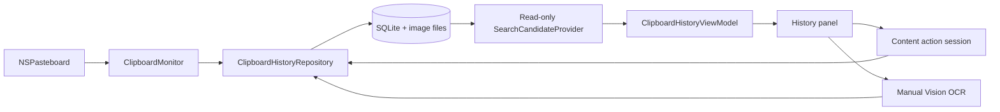
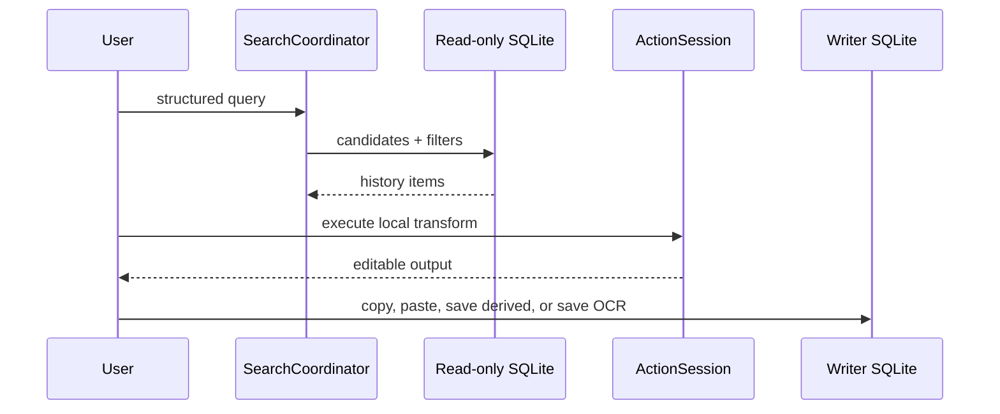

# Overall Architecture

粘易 is a local-first macOS menu-bar clipboard history app. The app process owns all writes; asynchronous search uses a separate read-only SQLite connection so typing does not contend with clipboard capture.

## Module boundaries

| Module | Responsibility |
|---|---|
| `App` | App lifecycle, status item and fullscreen-safe `HistoryPanelWindow`. |
| `Clipboard` | Pasteboard observation, capture filtering, writes and restoration suppression. |
| `Database` | Schema migration, transactional writes, local history metadata and capture events. |
| `Search` | Parse structured input, merge controls, issue read-only candidate queries and rank results. |
| `ContentActions` | Classification, deterministic local transforms, session history and syntax tokens. |
| `OCR` | Explicit user-triggered Vision request for one managed image at a time. |
| `ViewModels` / `Views` | Main-actor state and SwiftUI/AppKit presentation. |

## Data and concurrency

`DatabaseInitializer` opens the writer connection. `SearchCandidateProvider` is an actor that opens, uses and closes a read-only connection per request. Clipboard text, decoded action output and OCR output are never sent to a network service.

## Search, action and OCR lifecycle

`ActionSession` retains only the active transformation branch. Copy increments reuse count; a successfully dispatched direct paste increments paste count; save-derived does not increment source usage. OCR is never an automatic historical scan: a user selects one image, edits the recognition, and explicitly saves it. Saving preserves image storage type but enables OCR text search and type-aware actions.
