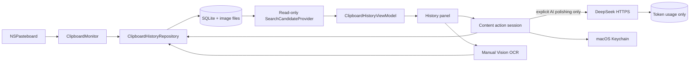
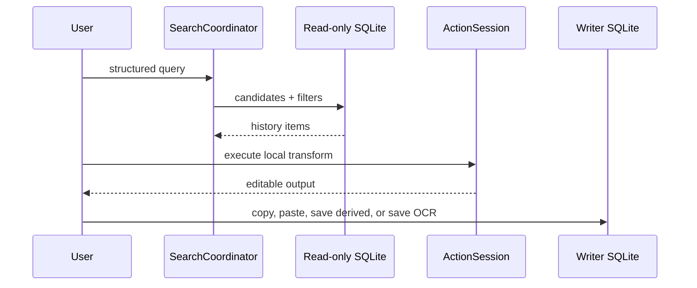
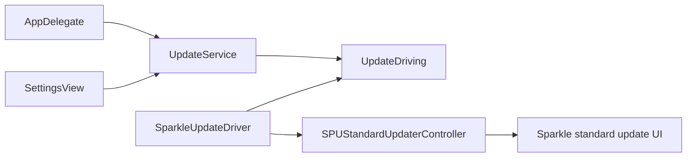

# Overall Architecture

粘易 is a local-first macOS menu-bar clipboard history app. The app process owns all writes; asynchronous search uses a separate read-only SQLite connection so typing does not contend with clipboard capture.

## Module boundaries

| Module | Responsibility |
|---|---|
| `App` | App lifecycle, status item and fullscreen-safe `HistoryPanelWindow`. |
| `Clipboard` | Pasteboard observation, capture filtering, writes and restoration suppression. |
| `Database` | Schema migration, transactional writes, local history metadata and capture events. |
| `Search` | Parse structured input, merge controls, issue read-only candidate queries and rank results. |
| `ContentActions` | Classification, deterministic local transforms, session history and syntax tokens. |
| `Services` | Automatic-paste policy, Keychain credential boundary, and explicit DeepSeek polishing client. |
| `OCR` | Explicit user-triggered Vision request for one managed image at a time. |
| `Services` | Shared application services, including the testable Sparkle update boundary. |
| `ViewModels` / `Views` | Main-actor state and SwiftUI/AppKit presentation. |

## Data and concurrency

`DatabaseInitializer` opens the writer connection. `SearchCandidateProvider` is an actor that opens, uses and closes a read-only connection per request. Clipboard capture, search, deterministic actions, and OCR remain local. The sole network path is an explicitly selected AI Polishing action: after first-use disclosure, the current action text is sent over HTTPS to DeepSeek. The API key stays in macOS Keychain. SQLite stores provider/model/token counts only, never prompts, source text, responses, or credentials.

Automatic paste is controlled by a persisted default-off preference and live Accessibility trust. The shared policy returns clipboard-only, permission-required, or ready; every paste path restores/copies first and dispatches `Command-V` only in the ready state.

## Search, action and OCR lifecycle

`ActionSession` retains only the active transformation branch. Copy increments reuse count; a successfully dispatched direct paste increments paste count; save-derived does not increment source usage. OCR is never an automatic historical scan: a user selects one image, edits the recognition, and explicitly saves it. Saving preserves image storage type but enables OCR text search and type-aware actions.

## Software update subsystem

The application links Sparkle at the exact package version `2.9.2`. `AppDelegate` owns one lazy `UpdateService` backed by one `SparkleUpdateDriver` and injects that same service into both Settings entry points. This keeps Sparkle's updater controller alive for the application lifecycle and prevents duplicate update sessions.

`UpdateDriving` is the test boundary. It publishes `canCheckForUpdates`, `automaticallyChecksForUpdates`, and `UpdateStatus`; `SparkleUpdateDriver` supplies the preference streams from Sparkle's KVO-compliant updater properties and the status stream from `SPUUpdaterDelegate` events. `UpdateService` mirrors these values as `@Published` main-actor state, exposes whether a manual check can start, and reports checking, up-to-date, update-available, and failure outcomes. User preference writes travel through `setAutomaticallyChecksForUpdates(_:)` to Sparkle, while driver-originated changes only update service state. This one-way subscription prevents feedback loops and keeps the About toggle synchronized when Sparkle's authorization UI changes the preference.

The app owns only the About controls and a concise status summary. `SPUStandardUpdaterController` remains responsible for the complete update-check progress, release notes, download, authorization, installation, cancellation, and relaunch UI. Because the app normally runs as an `LSUIElement`, `SparkleUpdateDriver` also implements Sparkle's gentle scheduled-reminder capability: it temporarily promotes an accessory app to a regular Dock application, badges the Dock icon for scheduled updates, clears the badge when the update receives attention, and restores accessory mode after the update session unless the user enabled the Dock icon preference.

`AppVersionProviding` is the test boundary for the About version label. `AppVersionInfo` is its Bundle-backed implementation, while `SettingsView` accepts any provider so tests and previews do not depend on hard-coded release values.

The current branch configures and statically validates the fixed HTTPS feed, public EdDSA key, and sandboxed Sparkle XPC services. Private signing material remains outside the repository. A genuine signed/notarized release archive and end-to-end V1.0.0 → V1.0.1 upgrade remain release evidence gates rather than responsibilities of the observable updater boundary.
