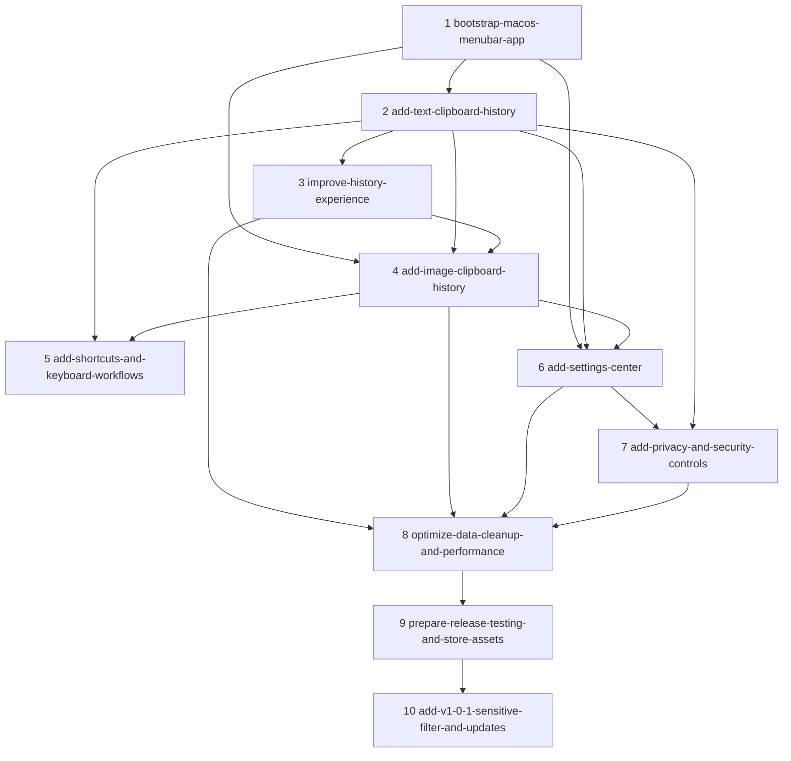

# Change Execution Order

This file defines the recommended implementation order for the OpenSpec changes under `openspec/changes/`.

The order starts with the original 9 project phases and adds follow-up changes that remain small enough to implement, verify, and archive independently.

## Recommended Sequence

| Order | Change | Purpose | Depends On | Start Condition | Completion Gate |
| --- | --- | --- | --- | --- | --- |
| 1 | `bootstrap-macos-menubar-app` | Build the runnable macOS SwiftUI menu bar app foundation. | None | OpenSpec artifacts are complete. | App launches, menu bar icon appears, main/settings windows open, Application Support directory and SQLite database initialize. |
| 2 | `add-text-clipboard-history` | Add text clipboard monitoring, persistence, search, restore, delete, and clear. | `bootstrap-macos-menubar-app` | App shell, storage directory, database initialization, and basic windows are working. | Copied text is recorded, deduped, searchable, restorable, deletable, clearable, and persists after restart. |
| 3 | `improve-history-experience` | Improve list usability with previews, details, favorites, filters, time display, and lazy loading. | `add-text-clipboard-history` | Text history list and repository queries exist. | Long content remains readable, details open, favorites work, filters work, and large lists scroll smoothly. |
| 4 | `add-image-clipboard-history` | Add image clipboard capture, file storage, thumbnails, metadata, restore, deletion cleanup, and image recording controls. | `bootstrap-macos-menubar-app`, `add-text-clipboard-history`, `improve-history-experience` | Storage, database, shared history model, and list/detail surfaces are available. | Screenshots and browser images are recorded, previewed, restorable, deleted with files, and controlled by the image recording setting. |
| 5 | `add-shortcuts-and-keyboard-workflows` | Add global shortcut activation, keyboard navigation, Enter restore, Escape close, and feedback. | `add-text-clipboard-history`; preferably `add-image-clipboard-history` | Main panel open/restore flows exist for at least text records. | Shortcut opens the panel, keyboard selection works, Enter restores selected content, Escape closes panel, conflicts are handled. |
| 6 | `add-settings-center` | Complete user settings for recording toggles, startup, Dock icon, retention, limits, storage cap, and clear-all. | `bootstrap-macos-menubar-app`, `add-text-clipboard-history`, `add-image-clipboard-history` | Settings window exists and text/image capture paths can read settings. | Settings persist after restart, toggles affect capture, limits are readable by cleanup/capture, clear-all removes database and image files. |
| 7 | `add-privacy-and-security-controls` | Add privacy notice, sensitive filtering, pause, blocked apps, foreground app detection, cleanup, and privacy documentation. | `add-settings-center`, `add-text-clipboard-history`; image capture recommended | Capture gates and settings persistence exist. | First-launch notice appears, sensitive content is skipped, pause works, blocked apps are skipped, privacy policy exists. |
| 8 | `optimize-data-cleanup-and-performance` | Add cleanup rules, indexes, pagination, thumbnail caching, polling tuning, and stability checks. | `add-text-clipboard-history`, `improve-history-experience`, `add-image-clipboard-history`, `add-settings-center`, `add-privacy-and-security-controls` | Core capture, listing, settings, favorites, and privacy gates are implemented. | 1000 text records search acceptably, 100 image records scroll smoothly, cleanup bounds data and file growth, CPU/memory are stable. |
| 9 | `prepare-release-testing-and-store-assets` | Configure release packaging, sandboxing, signing, compatibility testing, QA, docs, privacy policy, and screenshots. | All implementation changes | Feature scope is frozen and previous completion gates pass. | Signed Release build launches and passes compatibility, common-app, large-content, cleanup, documentation, privacy, and screenshot checks. |
| 10 | `add-v1-0-1-sensitive-filter-and-updates` | Deliver V1.0.1's user-controlled sensitive filtering, runtime version display, and secure GitHub Releases updates. | V1.0.0 feature and release foundations; `complete-user-controls-and-release-readiness` where its remaining release evidence applies | V1.0.0 behavior and release configuration are available for regression and upgrade testing. | V1.0.1 (build 2) preserves safe filtering by default, displays runtime bundle information, and completes a verified V1.0.0-to-V1.0.1 Sparkle upgrade without data loss. |

## Dependency Shape

## Parallelization Notes

- `add-shortcuts-and-keyboard-workflows` can begin after text restore exists, but final verification should wait until image restore exists if keyboard restore must support both text and images.
- `add-settings-center` can start once the settings window exists, but toggle and limit application should be finished after text and image capture paths exist.
- `add-privacy-and-security-controls` should not be delayed until the end of the product; implement it before performance and release work so sensitive data is not captured during extended testing.
- `optimize-data-cleanup-and-performance` should wait until the main data-producing features exist; otherwise performance work risks optimizing incomplete query and storage paths.
- `prepare-release-testing-and-store-assets` should be last because sandboxing, signing, and release QA can expose regressions across all earlier features.
- `add-v1-0-1-sensitive-filter-and-updates` follows the V1.0.0 release foundation because it changes release metadata, entitlements, and the installed-app upgrade path; its V1.0.0-to-V1.0.1 test requires an installed baseline app.

## Archive Recommendation

Archive changes in the same order after each completion gate passes:

1. `bootstrap-macos-menubar-app`
2. `add-text-clipboard-history`
3. `improve-history-experience`
4. `add-image-clipboard-history`
5. `add-shortcuts-and-keyboard-workflows`
6. `add-settings-center`
7. `add-privacy-and-security-controls`
8. `optimize-data-cleanup-and-performance`
9. `prepare-release-testing-and-store-assets`
10. `add-v1-0-1-sensitive-filter-and-updates`

Do not archive a later change before its dependencies unless the spec deltas have been reviewed and the dependency relationship has changed.
